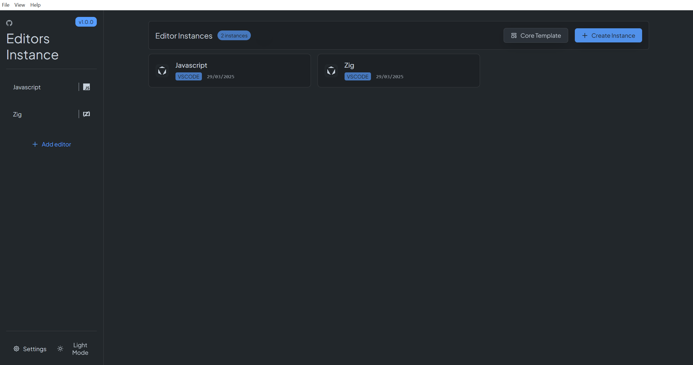
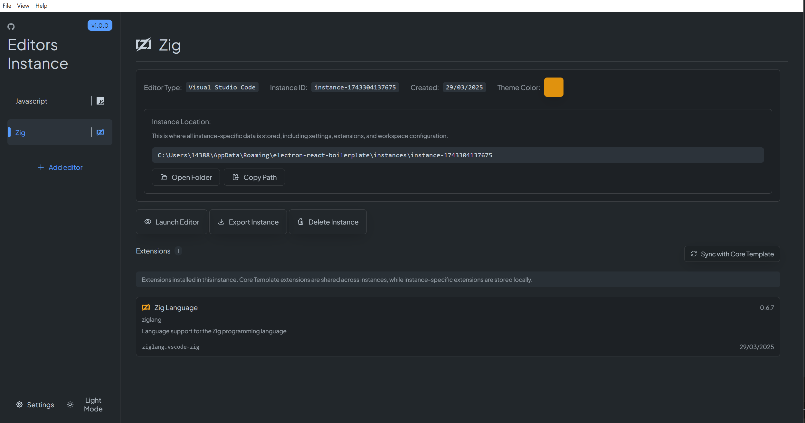

# VSCode Instance Manager

<p align="center">
  <!-- TODO: Add your logo image here -->
  
</p>

<p align="center">
  A powerful and intuitive manager for VSCode and Cursor editor instances
</p>

<div align="center">

[](https://opensource.org/licenses/MIT)
[](http://makeapullrequest.com)

<!-- TODO: Add your CI/build badges here -->

</div>

## ✨ **Key Features**

### 🚀 **Multiple Editor Instances**
- Launch and manage multiple VSCode and Cursor instances in parallel
- Organize your work environments based on your projects

### 🔄 **Smart Sync**
- Use a core template to automatically install a set of base extensions
- Each instance can have its own extensions without affecting others

### 🎨 **Theme Customization**
- Assign a unique name and color code to each instance
- Change the title bar color for quick identification

### 📦 **Import/Export Configurations**
- Export your configurations to share them with your team
- Import a configuration and instantly restore your ideal setup

### 🎯 **Instance-Specific Settings**
- Separate settings and extensions for each project
- Ideal for testing new extensions without affecting your main environment

## 🖥️ Screenshots

<!-- TODO: Add these screenshots -->
<p align="center">
  
  <br/>
  <em>Clean and intuitive home interface</em>
</p>

<p align="center">
  
  <br/>
  <em>Powerful instance management features</em>
</p>

## 🚀 Getting Started

### Prerequisites

- Node.js 14.x or higher
- npm or yarn
- Windows/macOS/Linux

### Installation

1. Clone the repository:

```bash
git clone https://github.com/yourusername/vscode-instance-manager.git
cd vscode-instance-manager
```

2. Install dependencies:

```bash
npm install
# or
yarn install
```

3. Start the application:

```bash
npm start
# or
yarn start
```

## 📖 Usage Guide

### Creating Your First Instance

1. Launch the application
2. Click "Create Instance" in the top right
3. Choose between VSCode or Cursor
4. Configure your instance settings
5. Click "Create" to generate your new editor instance

### Managing Extensions

- Use the core template to maintain a base set of extensions
- Sync extensions between instances with one click
- Keep instance-specific extensions separate

### Customizing Instances

- Set unique colors for each instance's title bar
- Manage workspace-specific settings
- Configure instance-specific parameters

### Import/Export Features

Share your editor setup:

1. Select an instance
2. Click "Export Instance"
3. Choose a location to save the .zip file

Import a shared setup:

1. Click "Import Instance"
2. Select the .zip file
3. The instance will be automatically configured

## 🤝 Contributing

We love contributions! Here's how you can help:

1. Fork the repository
2. Create your feature branch (`git checkout -b feature/AmazingFeature`)
3. Commit your changes (`git commit -m 'Add some AmazingFeature'`)
4. Push to the branch (`git push origin feature/AmazingFeature`)
5. Open a Pull Request

See our [Contributing Guide](CONTRIBUTING.md) for more details.

## 🔧 Development

### Project Structure

src/
├── main/ # Main process
│ ├── features/ # Core features
│ └── ipc/ # IPC handlers
├── renderer/ # Renderer process
│ ├── components/ # React components
│ └── styles/ # CSS styles
└── shared/ # Shared utilities

```

## 📝 License

This project is licensed under the MIT License - see the [LICENSE](LICENSE) file for details.

## 🙏 Acknowledgments

- The Electron community
- VSCode and Cursor teams
- All our contributors

---

<p align="center">
  Made with ❤️ by the VSCode Instance Manager team
</p>
```
